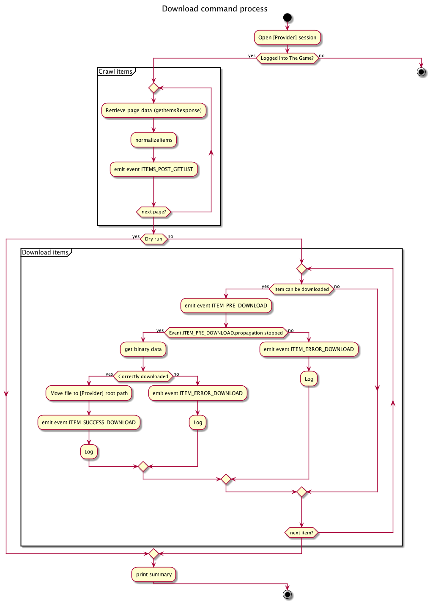

# DeejayPoolBundle

[](LICENSE.txt)
[](https://travis-ci.org/Pyrex-FWI/DeejayPoolBundle)
[](https://www.codacy.com/app/yemistikris/DeejayPoolBundle)

# Getting started


## Installing DeejayPoolBundle

Update your composer.json

```json
"require-dev": {
    "pyrex-fwi/avdistrict-bundle": "dev-master"
}
```
or 

`composer require pyrex-fwi/avdistrict-bundle`

Update your `app/config/AppKernel.php` file

```php
<?php

public function registerBundles()
{
    $bundles = [
        // ...
        new DeejayPoolBundle\DeejayPoolBundle()
        // ...
    ];

    // ...
}

?>
```php

Add your account information into config.yml

```yaml
deejay_pool:
    providerName:
        credentials:
            login: replace_with_yours
            password: replace_with_yours
        configuration:
            root_path: /replace/by/writable/path/destination

```

## Supported providers

* AvDistrict (Videos, [Create account](http://www.avdistrict.net/Account/Register))
* DigitalDjPool (Musics, [Create account](https://digitaldjpool.com/Account.aspx/Register))
* Samsh Vision (Videos, [Create account](https://www.smashvision.net/Home/Register)
* Franchise Record Pool(Musics and videos, [Create account](http://www.franchiserecordpool.com)

```yaml
deejay_pool:
    av_district:
        credentials:
            login:    %av_district.credentials.login%
            password: %av_district.credentials.password%
        configuration:
            root_path: %av_district.configuration.root_path%

    franchise_pool_audio:
        credentials:
            login:    brubruno
            password: maladede
        configuration:
            root_path: %franchise_pool.configuration.root_path%

    franchise_pool_video:
        credentials:
            login:    %franchise_pool.credentials.login%
            password: %franchise_pool.credentials.password%
        configuration:
            root_path: %franchise_pool.configuration.root_path%
    
    smashvision:
        credentials:
            login:    %smashvision.credentials.login%
            password: %smashvision.credentials.password%

        configuration:
            root_path: %smashvision.configuration.root_path%
```

## Console usages:

-  deejay:discover                         (Discover prodivers)
-  deejay:pool:status                      (Check account credentials)
- -  php app/console deejay:pool:status franchise_pool_audio -vvv
-  deejay:pool:download                    (Download files from a specific provider)
 - download files 
 - search files

#### Run tests

- vendor/bin/phpunit -c phpunit.xml --debug --verbose
- vendor/bin/phpunit -c phpunit.xml --debug --verbose --coverage-html Tests/TestData/Coverage
- vendor/bin/phpunit -c phpunit.xml --debug --verbose --coverage-html Tests/TestData/Coverage --debug --stop-on-error -v


Events
======

Session events
==============

| Name              |                                                  |
|:------------------|:------------------------------------------------:|
| SESSION_OPENED    | After successful PoolProviderInterface::open()   |
| SESSION_OPEN_ERROR| When error occur on PoolProviderInterface::open()|
| SESSION_CLOSED    | After successful PoolProviderInterface::close()  |


Item events
===========

| Name                            |                                                                                  |
|:------------------------------- |:--------------------------------------------------------------------------------:|
| ITEMS_POST_GETLIST              | After successful page items normalization in PoolProviderInterface::getItems()   |
| ITEM_PRE_DOWNLOAD               | Triggered inside PoolProviderInterface::downloadItem() before true request       |
| ITEM_SUCCESS_DOWNLOAD           | Dispatched when an item is correctly downloaded                                  |
| ITEM_ERROR_DOWNLOAD             | Dispatched when itemCanBeDownloaded/ItemPreDownload propagation is stopped/Http Download Error /  |
| SEARCH_ITEM_LOCALY      | Dispatched when an item is correctly downloaded                                  |


    


    SEARCH_ITEM_LOCALY = 'provider.search.item.localy';

http://gnugat.github.io/2014/10/29/sf2-bundle-standalone.html



